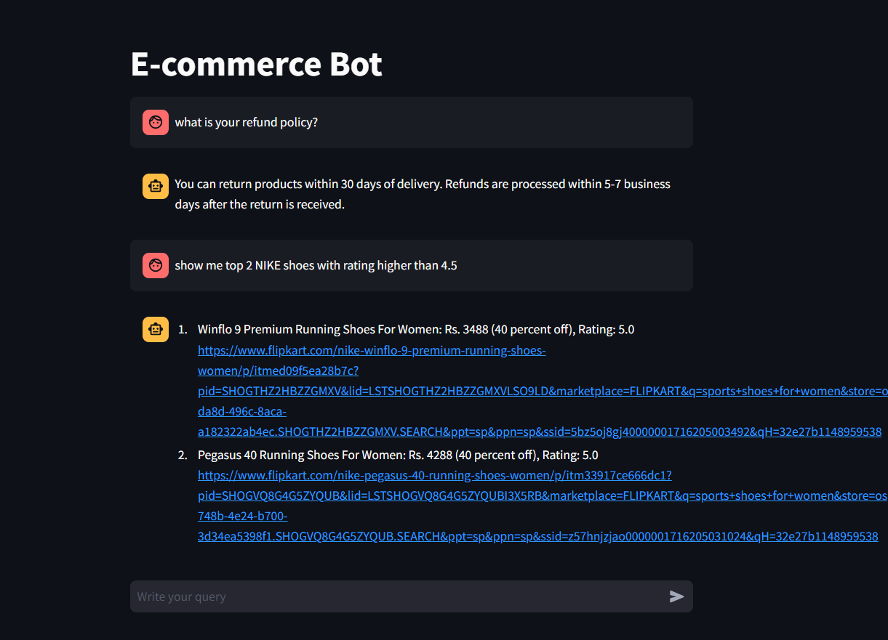
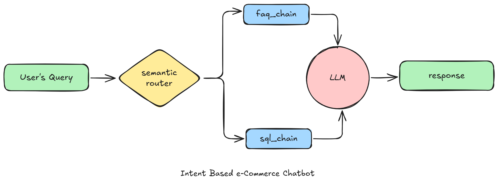

# 💬 E-Commerce GenAI RAG Chatbot

An intelligent **GenAI-powered e-commerce chatbot** built using **Llama 3.3 and Groq** that understands user intent and provides relevant responses based on e-commerce information.

The chatbot supports both **FAQ-based questions** and **real-time product queries**, allowing users to interact with an e-commerce platform using natural language instead of manually searching through products or documentation.

---

## 🚀 Project Overview

This project is a **Proof of Concept (POC)** for an intelligent e-commerce conversational assistant.

The system identifies the intent behind a user's query and routes it to the appropriate processing workflow.

It currently supports two primary intents:

### 💬 1. FAQ Intent

Handles questions related to the e-commerce platform's policies and general information.

**Example queries:**

```text
Is online payment available?

What is the return policy?

Do you provide cash on delivery?
```

The chatbot retrieves the relevant information and generates a natural-language response.

---

### 🛒 2. SQL Intent

Handles product-related queries that require information from the e-commerce database.

**Example queries:**

```text
Show me all Nike shoes below Rs. 3000.

Find Adidas shoes under Rs. 5000.

Show me products available in size 9.
```

The system processes the user's natural-language request and retrieves the relevant product information from the database.

---

## 🖥️ Application Preview



---

## 🏗️ Architecture



The application follows an intent-driven architecture where the user's query is first analyzed and then routed to the appropriate workflow.

```text
                         User Query
                              │
                              ▼
                    ┌──────────────────┐
                    │  Intent Detection│
                    └────────┬─────────┘
                             │
                    ┌────────┴─────────┐
                    │                  │
                    ▼                  ▼
                 FAQ Intent        SQL Intent
                    │                  │
                    ▼                  ▼
              FAQ Knowledge      Product Database
                    │                  │
                    └────────┬─────────┘
                             ▼
                    ┌──────────────────┐
                    │   Llama 3.3 LLM  │
                    │      + Groq      │
                    └────────┬─────────┘
                             │
                             ▼
                    Natural Language
                         Response
```

---

## 🧠 GenAI / RAG Workflow

The chatbot combines LLM-based reasoning with retrieval to provide context-aware responses.

### FAQ Workflow

```text
User Question
      ↓
Intent Detection
      ↓
FAQ Retrieval
      ↓
Relevant Context
      ↓
Llama 3.3 via Groq
      ↓
Final Answer
```

### Product / SQL Workflow

```text
User Product Query
        ↓
Intent Detection
        ↓
Query Processing
        ↓
Database Query
        ↓
Product Information
        ↓
Llama 3.3 via Groq
        ↓
Natural Language Response
```

This allows users to interact with the e-commerce system using natural language rather than directly interacting with the underlying database.

---

## ✨ Key Features

- 🤖 GenAI-powered conversational interface
- 🧠 Natural-language intent detection
- 🔎 FAQ information retrieval
- 🛒 Product search using database queries
- ⚡ Fast LLM inference using Groq
- 🦙 Llama 3.3 integration
- 💬 Natural-language responses
- 🗄️ Real-time product information retrieval
- 🌐 E-commerce website data collection through web scraping
- 🖥️ Interactive Streamlit interface

---

## 🧰 Tech Stack

| Technology | Purpose |
|---|---|
| 🐍 Python | Core programming language |
| 🦙 Llama 3.3 | Large Language Model |
| ⚡ Groq | LLM inference |
| 🧠 RAG | Retrieval-augmented responses |
| 🗄️ SQL | Product data querying |
| 🌐 Web Scraping | E-commerce data collection |
| 🎈 Streamlit | Chatbot interface |
| 🔐 python-dotenv | Environment configuration |

---

> **Note:** Never commit your actual `.env` file or expose your API key on GitHub.

---

# ⚙️ Setup & Execution

## 1. Clone the Repository

```bash
git clone https://github.com/GouravBhat/E-COMMERCE-CHATBOT-BASED-ON-REAL-FLIPKART-COMPANY-DATA-.git
```

Navigate to the project directory:

```bash
cd E-COMMERCE-CHATBOT-BASED-ON-REAL-FLIPKART-COMPANY-DATA-
```

---

## 2. Install Dependencies

Install the required Python dependencies:

```bash
pip install -r app/requirements.txt
```

---

## 3. Configure Groq API

Inside the `app` directory, create a `.env` file:

```text
app/.env
```

Add your Groq credentials:

```env
GROQ_MODEL=llama-3.3-70b-versatile
GROQ_API_KEY=your_groq_api_key_here
```

Replace the values with your own credentials.

### 🔐 Security

Never upload your `.env` file to GitHub.

Add this to `.gitignore`:

```gitignore
.env
__pycache__/
*.pyc
.venv/
```

You can also create an `.env.example` file:

```env
GROQ_MODEL=llama-3.3-70b-versatile
GROQ_API_KEY=your_groq_api_key_here
```

This allows other developers to understand which environment variables are required without exposing your credentials.

---

# ▶️ Run the Application

Start the Streamlit application using:

```bash
streamlit run app/main.py
```

After the application starts, open the local Streamlit URL displayed in your terminal.

---

# 🧪 Example Queries

### FAQ Queries

```text
Is online payment available?

What is the return policy?

What payment methods are supported?
```

### Product Queries

```text
Show me all Nike shoes below Rs. 3000.

Find running shoes under Rs. 5000.

Show me available Nike products.
```

The chatbot determines the intent of the query and uses the appropriate workflow to generate the response.

---

# 🔄 Intent-Based Processing

One of the core concepts of this project is **intent-based routing**.

```text
                 User Query
                     │
                     ▼
              Intent Detection
                     │
            ┌────────┴────────┐
            │                 │
            ▼                 ▼
           FAQ               SQL
            │                 │
            ▼                 ▼
      FAQ Retrieval      Database Query
            │                 │
            └────────┬────────┘
                     ▼
                LLM Response
                     │
                     ▼
                User Answer
```

This architecture makes it possible to extend the chatbot with additional intents in the future.

---

# 🌐 Web Scraping Component

The repository also contains a dedicated `web-scraping` directory for collecting e-commerce information.

The scraped data can be processed and used as a source for the chatbot's product-related functionality.

```text
E-Commerce Website
        ↓
    Web Scraping
        ↓
   Product Data
        ↓
     Database
        ↓
   Chatbot Query
        ↓
     Response
```

# 🎯 Learning Outcomes

This project demonstrates practical experience with:

- Generative AI application development
- LLM integration
- Retrieval-Augmented Generation
- Intent classification and routing
- Natural-language database querying
- SQL-based data retrieval
- Web scraping
- Prompt engineering
- Streamlit application development
- API and environment configuration

---

# 👨‍💻 Author

**Gourav Bhatt**

AI/ML Engineer | Generative AI | Data Science | Python | RAG | LLMs | Full-Stack Development

- GitHub: [@GouravBhat](https://github.com/GouravBhat)
- LinkedIn: `Add your LinkedIn URL here`

---

## ⭐ If You Find This Project Useful

If you find this project interesting, consider giving the repository a ⭐ and exploring the other AI/ML projects on my GitHub profile.

<p align="center">
  <b>Built with Python, Llama 3.3, Groq & Streamlit 🤖</b>
</p>
